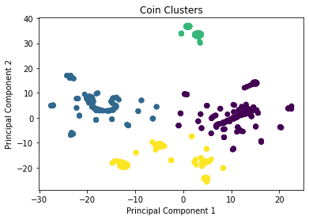

# Unsupervised Machine Learning Challenge

To explore the results and recommendation, please open "crypto_analysis.ipynb."

## Background

With data from [CryptoCompare](https://min-api.cryptocompare.com/data/all/coinlist), the task of this challenge is to determine if current, actively mined coins can be grouped in order to create a new classification system. As there are no current labels to group our data points into, we must use unsupervised learning in order to create those classifications ourselves.

## Methods

This challenge heavily uses the `scikit-learn` library, utilizing the `StandardScalar`, `PCA`, `TSNE`, and `KMeans` models to narrow down the important features and to demonstrate potential groupings. `Pandas` was used for preprocessing, such as removing unimportant columns from the data and cleaning up missing data points. `Matplotlib` was used for visualization.

**The recommendation has written below for convenience.**

## Recommendation

Based on the most important features as determined by the PCA and t-SNE models, it looks as though these cryptocurrencies that are currently actively mined can be grouped into approximately 4 clusters.

